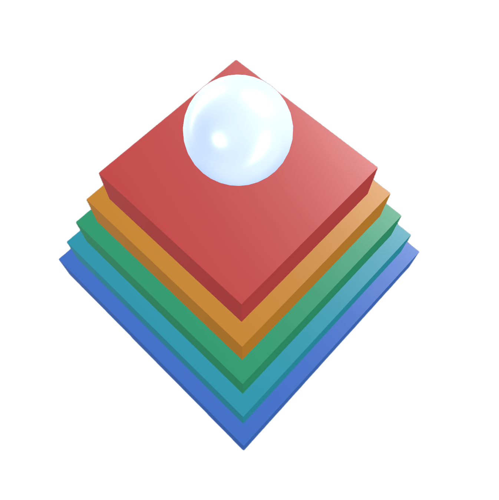
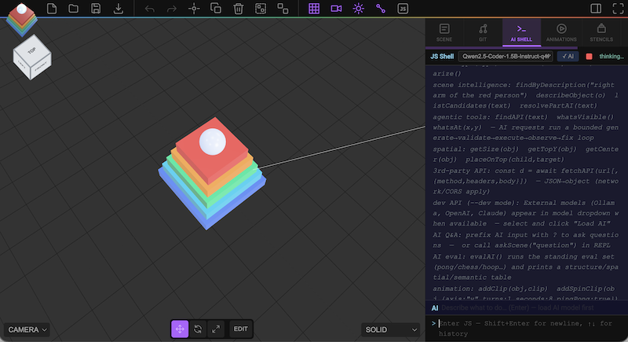

# Strata — Local-First AI for Building 3D Scenes

A sovereign, AI-native 3D scene editor that builds, edits, and reasons about scenes via natural language. Local LLM inference, executes output through the integrated JS shell (command pattern → undo stack), and versions scenes through git.

**No server. No API keys. No data leaves the device.**



---

## Quick start

```bash
npx serve docs       # local dev — or point GitHub Pages at docs/
```

Requires **Chrome 113+** (WebGPU). Verify at [webgpureport.org](https://webgpureport.org).

**With external AI models (Ollama, OpenAI, Claude):**

```bash
# Terminal 1: Start server with dev mode enabled
export ANTHROPIC_API_KEY="sk-ant-..."  # or OPENAI_API_KEY
DEV=1 node server.js

# Terminal 2: Open http://127.0.0.1:5500 in Chrome
# External models now appear in the model dropdown
```

---

## Features

| | |
|---|---|
| **Sovereign AI** | 100 % on-device inference via WebGPU (WebLLM / MLC). Prompts and scenes never leave the browser. |
| **No build step** | Serve `docs/` as-is. Plain ES modules, importmap, no bundler. |
| **JS Shell** | Interactive REPL — a tab in the right sidebar (**View → JS Shell**). Same scope as the AI. |
| **One execution surface** | AI-generated and human-typed code run through the same `execute()` binding — same undo stack, same error handling, no second path. |
| **Agentic loop** | AI requests run a bounded **generate → validate → execute → observe → fix** loop — the model checks its own output against the real API and the resulting scene change, and self-corrects. |
| **No API hallucination** | Real command/op/material/geometry signatures are indexed locally and injected before generation + linted after, killing invented classes and wrong arguments. |
| **Model-free scene grounding** | GPU color-picking answers "what's visible / what's under this point" from the renderer — no vision model. |
| **Scene Q&A** | Ask the AI about the scene in plain English (prefix with `?`). No code generated or run. |
| **Modeling ops** | Boolean CSG, mirror, array, subdivision — undoable and AI-callable. |
| **Edit Mode** | Half-edge mesh editing: vertex/edge/face selection, extrude, inset, bevel, delete, weld, UV projection. |
| **Keyframe animation** | An **Animations** tab to author clips by hand (create / key / interpolate / play) — and the AI can author clips too ("make the box bounce", "spin it 360° over 2s") via `addClip`. |
| **Scene intelligence** | Resolve descriptive part references ("the right arm of the red person") on imported GLBs with meaningless node names — geometry + color + symmetry descriptors, no vision model. |
| **Parametric codegen** | Edited meshes record a construction recipe (primitive + ops) so "export as JS" stays readable instead of dumping raw vertices. |
| **Git integration** | Auto-load on open, commit, and a split-screen merge-conflict viewport. AI writes diff-aware commit messages. |
| **Error-feedback retry** | If generated code throws, the error is fed back to the model for one auto-correction pass. |

---

## AI models

Select a model from the shell header and click **Load AI**. Weights download once and cache in browser storage.

### Browser-based models (WebLLM)

| Label | Model ID | Size | Notes |
|-------|----------|------|-------|
| **Default** | `Qwen2.5-Coder-1.5B-Instruct-q4f16_1-MLC` | ~1 GB | Fast; best for structural/edit (see routing) |
| **Power** | `Qwen2.5-Coder-7B-Instruct-q4f16_1-MLC` | ~4.5 GB | Best at decomposition; needs ≥8 GB VRAM |
| **Lite** | `Llama-3.2-1B-Instruct-q4f32_1-MLC` | ~900 MB | Weak / integrated GPUs only |

### External API models (Dev Mode)

Enable with `DEV=1 node server.js` to add:

| Provider | Models | Setup | Notes |
|----------|--------|-------|-------|
| **Ollama** | Any installed model (codellama, neural-chat, mistral, etc.) | `ollama serve` in another terminal | Local; no API key needed |
| **OpenAI** | gpt-4, gpt-4-turbo, gpt-3.5-turbo | `export OPENAI_API_KEY="sk-..."` | Cloud; best for complex code |
| **Anthropic** | claude-3-5-sonnet, claude-3-opus, claude-3-haiku | `export ANTHROPIC_API_KEY="sk-ant-..."` | Cloud; excellent for 3D generation |

External models appear in the dropdown **below** WebLLM models (marked with source: Ollama, OpenAI, Claude).

On load the engine requests an **8192-token context window** (overriding the 4096
default) so the system prompt + RAG hints + retry history have headroom; it falls
back to 4096 automatically if the compiled model rejects the larger window. The
shell prints the window in effect (`AI ready — … (context window: N tokens)`).

---

## Model tiers — which to use when

Backed by a standing 19-prompt eval (`evalAI()`, below) scored on four axes, run
1.5B vs 7B side-by-side. **The 7B is not a strict upgrade — route by task type.**

| Use the **1.5B Default** for | Use the **7B Power** for |
|---|---|
| taught + near-neighbor scenes (pong, ping-pong) | multi-part decomposition (air-hockey w/ goals, desk lamp = base+stem+shade, net, bench) |
| flat structural grids (chess, tiled floor, fence, staircase) | knowledge edits where details matter (correct color names, correct "clear scene") |
| lookup / edit (scale, delete, recolor) | requests the 1.5B returns as a single primitive |

**Why not always 7B:** it has the world-knowledge to decompose, but it
**over-engineers simple flat layouts into vertical X-Y walls** and **over-reaches
for unsupported APIs** (`BufferGeometry`), so it *regresses* the simple
structural/near-neighbor cases the 1.5B nails. The shell already surfaces a
`💡 try the Power model` hint when a compositional request comes back as one
primitive (`shouldSuggestPower` in `ai/eval.js`).

**Neither tier handles** (flagged by the eval, not yet solved): obscure board
layouts — backgammon / go / monopoly both fall back to the chess alternating-grid
template (a knowledge gap, not a size gap) — and reliably keeping furniture above
the ground plane.

### Eval harness — `evalAI()`

Type `evalAI()` in the JS shell (works from either input row) to run the standing
prompt set through the **real agentic loop** and print a 4-axis pass/fail table:

```
tier            | struct | spatial | semantic | distinct | prompt
```

| Axis | Checks |
|------|--------|
| **struct** | ran clean — IIFE, named, `AddObjectCommand`, no repetition loop / prose / overflow |
| **spatial** | flat things lie flat (X-Z), objects rest on/above the ground (no X-Y walls, no negative Y), and "X and Y" objects are placed apart (no co-location/overlap) |
| **semantic** | has the expected parts — and they are *distinct*, not N identical boxes |
| **distinct** | not over-fit (a non-chess "board" doesn't emit the chess template) and recolors yield the requested distinct colors |

The `distinct` axis exists because earlier 3-axis runs scored a chessboard-shaped
"traffic intersection" as a triple-pass — the gauge read green over a known fault.
Canary prompts (backgammon/go/monopoly) + an overfit detector make it visible.

Run `evalAI()` after any prompt change, and on both tiers to set routing. The
validation + translated-feedback layer (undefined-helper, duplicate-`const`,
`.add()`-on-Material, shared-material clone-on-write) is **model-independent** — it
caught and let the 7B *recover* the same bug classes it catches on the 1.5B.

### External API Model Selection

In dev mode, external models are auto-discovered and listed in the dropdown:

1. Select a model from the **External APIs** section (e.g., Claude, OpenAI, Ollama)
2. Click **Load AI** — the editor checks health instead of downloading weights
3. Type a prompt and send — it routes through the selected external API

No keys are exposed; all API communication stays server-side. See [Dev Mode](#dev-mode-external-apis) for setup details.

---

## JS Shell

The shell is the **SHELL tab** in the right sidebar (toggle with **View → JS Shell**). Type JavaScript directly or use the AI input row.

| Key / Input | Action |
|-------------|--------|
| `Enter` | Execute |
| `Shift+Enter` | New line |
| `↑` / `↓` | Command history |
| AI input + `Enter` | Generate and run code |
| AI input `? question` | Ask about the scene — plain-text answer, no code |

### Core globals

```js
editor THREE scene camera renderer

// Commands (all go through the undo stack)
AddObjectCommand RemoveObjectCommand
SetPositionCommand SetRotationCommand SetScaleCommand
SetMaterialColorCommand SetMaterialCommand SetValueCommand

// Primitives + organic geometry (no THREE. prefix)
BoxGeometry SphereGeometry CylinderGeometry ConeGeometry PlaneGeometry
TorusGeometry TorusKnotGeometry CircleGeometry CapsuleGeometry
LatheGeometry TubeGeometry ExtrudeGeometry ShapeGeometry Shape CatmullRomCurve3

// Materials (incl. PBR)
MeshStandardMaterial MeshPhysicalMaterial MeshBasicMaterial
MeshPhongMaterial MeshLambertMaterial LineBasicMaterial

Mesh Group Line Points
DirectionalLight PointLight AmbientLight SpotLight
Color Vector3 Vector2 Euler Quaternion

// Keyframe animation
AnimationClip VectorKeyframeTrack QuaternionKeyframeTrack
NumberKeyframeTrack ColorKeyframeTrack
addClip(object, clip)   // register a clip on object (or scene) → shows in Animations tab, playable
```

### Object lookup

```js
findObject('green cube')   // best match by NAME + material name + color + geometry type
findAll('box')             // every matching object
findOfType('Mesh')         // first object of a three.js type
findNear(mesh, radius)     // objects within radius world-units
```

`findObject` is word-scored and resolves descriptive queries even when the name is unhelpful: `findObject('red sphere')` matches an unnamed red `SphereGeometry` mesh via material color + geometry type. It also indexes **material names** and decodes glTF `_0XX_` escapes, so `findObject('tail light')` finds a part whose material is `Tail_032Light`.

### Spatial helpers (world-space, via `Box3`)

```js
getSize(obj)               // → {x,y,z} bounding box dimensions (geometry × scale)
getTopY(obj)               // → world Y of the top face
getCenter(obj)             // → world-space bounding box centre
placeOnTop(child, target)  // sets child.position.y to rest on top of target
lineFromPoints(pts, color) // → a Line through pts (Vector3[] or [x,y,z][]) — nets/wires/paths,
                           //   hides the BufferGeometry/LineBasicMaterial plumbing
```

### Scene intelligence (descriptive part resolution)

```js
findByDescription('the right arm of the red person')  // → node (or null)
describeObject(obj)        // → {region, shape, color, sizeRank, pair, ...} descriptor bundle
listCandidates('the two wheels at the back')          // → ranked candidates
resolvePartAI('the flat panel on top')                // async: rule match + LLM disambiguation
```

Deterministic geometry + color + symmetry descriptors are derived on import; ambiguous queries fall back to the already-loaded LLM reasoning over a compact descriptor table — **no vision model**. See [Scene intelligence](#scene-intelligence).

### Modeling ops (undoable, AI-callable)

```js
booleanUnion(a, b, keepInputs=false)      booleanSubtract(a, b, keepInputs=false)
booleanIntersect(a, b, keepInputs=false)  // three-bvh-csg
mirrorMesh(mesh, axis='x')                arrayDuplicate(mesh, count, dx, dy, dz)
subdivide(mesh, iterations=1)             listOps()   // print registered op schema
```

### Edit Mode ops

Enter with the **Edit** toolbar button or `enterEditMode()`; `Tab` toggles. Keys: `1/2/3` = vertex/edge/face, `A` = select all/none.

```js
enterEditMode()  exitEditMode()
extrude(distance=1)  inset(amount=0.2)  bevel(amount=0.1)
deleteFaces()  weld(threshold=0.01)
planarUV(axis='y')  boxUV()
selectFaces(...ids)  selectVertices(...ids)  selectEdges(...ids)
```

### Agentic grounding tools

```js
findAPI('set material color')   // retrieve the REAL signatures for an intent (anti-hallucination)
whatsVisible()                  // GPU color-pick: visible objects ranked by screen area
whatsAt(400, 300)               // GPU color-pick: object under a viewport pixel
```

### Codegen & Q&A

```js
showJS(obj?)   objectToJS(obj)   sceneToJS()   sceneEqual(a, b)   summarize()
askScene('which object is tallest?')      // plain-text answer
makeCheckerTex(512, 0x222, 0xccc, 16)     makeGridTex(512, 0x0f8, 12)   makeTexture(fn, size)
```

### External AI Models (Dev Mode)

```js
getAvailableModels()        // fetch and list all available models (WebLLM + external)
await askExternal('gpt-4', 'Create a red sphere')      // query an external model
await checkApiHealth()      // verify external services are running
```

**Example: Using Claude for 3D modeling**

```js
// When ANTHROPIC_API_KEY is set and DEV=1:
const code = await askExternal(
  'claude-3-5-sonnet-20241022',
  'Create a kitchen with a table and 4 chairs'
);
// Response is printed to output; copy-paste code into shell to run
```

### Third-party APIs (console)

`fetchAPI(url, options?)` calls any HTTP API and returns the parsed body (JSON → object,
otherwise text). A plain-object `body` is auto-JSON-encoded. `await` it from the shell:

```js
// GET → build a scene from live data
const items = await fetchAPI('https://api.example.com/products');
items.forEach((it, i) => {
  const m = new Mesh(new BoxGeometry(1,1,1), new MeshStandardMaterial({ color: it.color }));
  m.name = it.name; m.position.set(i * 1.5, 0.5, 0);
  editor.execute(new AddObjectCommand(editor, m));
});

// POST with auth + JSON body
await fetchAPI('https://api.example.com/save', {
  method: 'POST',
  headers: { Authorization: 'Bearer ' + token },
  body: { scene: sceneToJS().code },
});
```

> **Sovereignty note.** `fetchAPI` is the one helper that leaves the device — the request
> hits the network and the target must allow CORS. Everything else (inference, scene state,
> intelligence) stays on-device. Keep API keys in a variable you control; don't hard-code
> secrets into saved scenes (they'd be committed via Git).

---

## Dev Mode: External APIs

**Dev mode enables optional integration with Ollama, OpenAI, and Anthropic Claude** — keeping the editor sovereign by default (browser-only) while allowing developers to use more powerful models when needed.

### Setup

```bash
# Enable dev mode + set API keys
export ANTHROPIC_API_KEY="sk-ant-..."
export OPENAI_API_KEY="sk-..."
DEV=1 node server.js

# Optional: Start Ollama in another terminal
ollama serve
```

**What happens:**
- `/api/models` endpoint returns all available models (WebLLM + external)
- External models appear in the editor dropdown
- `/api/health` checks if services are running
- `/api/chat` proxies requests to the selected model

### Security

- **API keys stay server-side only.** Never sent to the browser or logged.
- **Request validation** — content-type check, request size limits, model validation
- **Response sanitization** — generic error messages, no service internals exposed
- **No caching** — API responses never cached; sensitive endpoints not exposed

Full security details in [DEV_MODE_API.md](DEV_MODE_API.md).

### Models in Dropdown

When dev mode is enabled, the model dropdown shows:

```
Qwen2.5-Coder 1.5B     (WebLLM - browser)
Qwen2.5-Coder 7B       (WebLLM - browser)
─── External APIs ───
codellama              (Ollama)
gpt-4                  (OpenAI)
claude-3-5-sonnet      (Claude)
```

### Using External Models

1. **Select** a model from the dropdown
2. **Click "Load AI"** — editor checks if the service is healthy
3. **Type a prompt** and send — routed to the selected model
4. **Response appears** in the output panel

All code execution still goes through the same command pattern (undoable).

---

## Edit Mode

A topology-aware **half-edge mesh editor** layered on top of `BufferGeometry`.

- **Enter:** select a Mesh → **Edit** toolbar button (or `enterEditMode()`). The mesh is converted to a half-edge `EditableMesh`; a colored overlay shows vertices, edges, and selected faces.
- **Select:** click in the viewport in vertex / edge / face mode (`1`/`2`/`3`). Face = pick triangle; vertex = nearest corner; edge = nearest edge.
- **Operate:** `extrude`, `inset`, `bevel`, `deleteFaces`, `weld`, `planarUV`, `boxUV`. Each op emits a `SetGeometryCommand` (undoable).
- **Exit:** `Tab` bakes the half-edge structure back to `BufferGeometry`. Round-trip is lossless for supported geometry.

### Parametric recipe (non-destructive history)

When you edit a primitive, the mesh records a **recipe** in `userData.recipe`:

```js
[ { op:'primitive', type:'BoxGeometry', args:[1,1,1] },
  { op:'extrude', params:{distance:2}, selection:{mode:'face', ids:[3]} },
  { op:'bevel',   params:{amount:0.1} } ]
```

`objectToJS()` replays the recipe instead of dumping raw vertices:

```js
var mesh = new THREE.Mesh(new THREE.BoxGeometry(1,1,1), mat);
enterEditMode(mesh); selectFaces(3); extrude(2); bevel(0.1); exitEditMode();
```

Readable, replayable, and git-diffable ("added: bevel" vs "400 floats changed"). Boolean/mirror results carry a provenance recipe comment; truly non-reconstructable geometry still falls back to a flagged JSON load (`result.lossy`).

---

## Keyframe animation

The **Animations** tab (right sidebar) is a full keyframe editor layered on `THREE.AnimationMixer`.

- **+ Clip** creates a clip; **◆ Key** records a keyframe for the selected object at the playhead
  on the enabled channels (**P** = position, **R** = rotation/quaternion, **S** = scale); **Del Key**
  / **🗑 Clip** remove them. **Auto** records a key whenever the selected object is transformed.
- Play / Pause / Stop and a draggable playhead; click a keyframe to scrub, drag it to retime,
  double-click a clip to rename. **Snap** quantises key times to an FPS grid.
- Clips are stored on `object.animations` (track name `<uuid>.<property>`) and serialise with the scene.

### AI-authored clips

The AI agent can author clips from natural language — "make the box bounce", "spin the wheel 360°
over 2 seconds", "fade it out". It builds real `KeyframeTrack`s and registers them with the
`addClip(object, clip)` helper, which drops the clip into the Animations tab ready to play:

```js
// what the agent emits for "make the box bounce"
const o = editor.selected;
const track = new VectorKeyframeTrack(
  o.uuid + '.position', [0, 0.5, 1],
  [o.position.x, o.position.y, o.position.z,
   o.position.x, o.position.y + 2, o.position.z,
   o.position.x, o.position.y, o.position.z]);
addClip(o, new AnimationClip('Bounce', -1, [track]));
```

The animation classes are in scope and on the validator allow-list, so generated clips pass the
same hallucination/arity lint as any other code. Position/scale use `VectorKeyframeTrack` (3 floats
per key), rotation uses `QuaternionKeyframeTrack` (4 floats, built from `Quaternion.setFromEuler`).
The agent authors **clips only** — runtime `requestAnimationFrame` loops remain out of scope.

---

## Scene intelligence

Resolves natural-language part references against imported GLBs whose nodes are named `Object_12, Object_44, …` — using **only deterministic math, the existing renderer, and the already-loaded code LLM. No new model download.**

**Per-node descriptors** (`userData.descriptors`, derived on import):
- **Region** — left/right/top/bottom/front/back within the parent bounding box.
- **Shape** — elongated / flat / blocky / thin (from sorted bbox dims → limb vs panel vs block).
- **Symmetry pairs** — reflect a sibling's centroid across the parent plane; matches tag left/right (the high-value primitive for arms/legs/wheels).
- **Color** — sampled from the **texture** (16×16 offscreen render → dominant HSV bin → color name), because `baseColorFactor` is usually white on real GLBs. Pure pixel math, reuses the renderer.
- Size rank, orientation, adjacency, hierarchy role.

**Resolution** is cheap-first: a deterministic rule match (free, offline) handles most queries; ambiguous ones build a compact, pre-filtered descriptor table and ask the loaded LLM to disambiguate. Never silently wrong — returns confidence and ranked candidates, and detects single merged-mesh GLBs (no per-part nodes) and says so.

The AI scene context is enriched with compact `desc(region,shape,color,pair)` tags so the main code-gen model can map "right arm of the red person" → node by reasoning, with zero extra inference.

---

## Reliable AI assist (the agentic loop)

Instead of "generate code and hope," every AI request runs a bounded, self-correcting loop — all on-device, no extra models:

```
generate → validate → execute → observe → fix   (max 3 retries, every action on the undo stack)
```

1. **Retrieve real APIs.** A local index of the actual command/op/material/geometry signatures (rebuilt at load, so it never goes stale) is searched by intent and injected *before* generation — the model sees the real `AddObjectCommand(editor, object)` and the real `metalness` key instead of guessing.
2. **Validate.** Generated code is statically linted against that index *before* running — invented classes (`Tree3D`), wrong command arity (a stray position arg), bad material keys (`metal:1`), undefined helper calls (`backWall()`), `.add()` on a Material/Geometry, duplicate-`const` redeclaration, `scene.add()` bypass, and constructed-but-never-added objects are all caught and fed back as **actionable** corrections (the fix, not the raw symptom). Identical re-tries stop early instead of looping.
3. **Execute** through the single shell surface (`editor.execute` → undo stack).
4. **Observe.** The scene is snapshotted before/after and diffed (added / removed / moved / scaled / recolored). The loop reports `✓ 1 recolored` — or, if a change was expected and *nothing* happened (usually a missed lookup), feeds that back for one corrective retry.
5. **Bounded & reversible.** Retries are hard-capped; every autonomous action is undoable; ambiguous/destructive ops surface candidates rather than guess.

**Scene grounding without a vision model.** Beyond the scene graph and descriptors, GPU color-picking renders each object in a unique ID color offscreen and reads pixels — giving `whatsVisible()` (what's on screen, by area) and `whatsAt(x, y)` (what's under a point). Deterministic, reuses the existing renderer, no download.

The net effect: real APIs (no hallucination), the right object (grounding), and a verified result (observation) — entirely on-device.

---

## AI scene context

Every request gets a compact JS-comment scene description — the format a code model reads most naturally:

```
// [selected] "Body" Mesh BoxGeometry(0.6,1.8,0.5) mat:"Red Paint" size(0.6,1.8,0.5) color:#cc2200(red) at(0,0.9,0) desc(blocky,red)
// "Object_12" Mesh size(0.1,0.3,0.1) mat:"Tail Light" color:#dd1100(red) at(0.8,0.4,-1) desc(right,elongated,red,pair-right)
// "Tree" Group(2 children) at(3,0,-2)
// Camera at(0,5,10) looking at(0,0,0)
```

Each line includes: object name (glTF `_0XX_` escapes **decoded**), **material name(s)** (often the only meaningful GLB label), geometry + key params, world-space `size`, **texture-sampled color**, transform (non-default only), hierarchy `[in:Parent]`, and the `desc(...)` intelligence tag. Large scenes (>900 chars) fall back to a compact JSON summary.

---

## Git integration

Open the **Git** menu to configure a repository and sync scenes. All calls use `fetch()` directly — no Octokit.

| Action | Behaviour |
|--------|-----------|
| **Settings** | Repo URL, branch, scene-file path, access token (see below). |
| **Load Scene** | Clears the scene and loads the repo's scene file. |
| **Compare with Remote** | Opens the **merge-conflict viewport** (below). |
| **Commit Scene** | AI writes a diff-aware message (added/removed/modified vs last commit), editable before commit. |
| **Auto-load on open** | If a repo is configured, the scene loads from GitHub on page open (after local autosave, so GitHub wins). **File → New** suppresses this once. |

Content is fetched with the GitHub **raw** media type (handles files >1 MB, decodes UTF-8 natively) and cache-busted so a fresh commit isn't served stale.

### Merge-conflict viewport

`Git → Compare with Remote` diffs your scene against the repo's and opens a split-screen review: **left = local, right = remote**, one shared orbit camera. Objects are tinted 🟢 added · 🔴 removed · 🟠 modified. A per-conflict list lets you choose local/remote/both per object (or **Accept All**), **🤖 AI Suggest** proposes resolutions, and **Apply Merge** rebuilds the scene from your choices.

> **Token storage & scope.** The access token lives in `localStorage` (`git-settings`) — readable by same-origin scripts, so treat it like a password. **Prefer a fine-grained, repo-specific PAT** (Settings → Developer settings → Fine-grained tokens) scoped to the one repo with **Contents: Read and write** only. A classic `repo`-scope token grants write access to every repository in your account — avoid it here.

---

## Scene representation

Two-form, lossless, git-diffable.

| # | Direction | Implementation |
|---|-----------|----------------|
| 1 | JS → Scene | Shell `execute()` |
| 2 | Scene → JSON | `scene.toJSON()` |
| 3 | JSON → Scene | `ObjectLoader.parse()` |
| 4 | Scene → JS | `codegen.js` — `objectToJS()` / `sceneToJS()` (recipe-aware) |

**Round-trip test (in-shell):**
```js
var snap = editor.scene.toJSON();
var js = sceneToJS();          // generate, paste js.code, run, then:
sceneEqual(snap, editor.scene.toJSON())   // { equal:true, differences:[] }
```

---

## Architecture

```
server.js              — Static file server + API proxy (dev mode)
  /api/models          — List WebLLM + external models (Ollama, OpenAI, Claude)
  /api/chat            — Proxy requests to external LLMs
  /api/health          — Check service availability

docs/editor/js/
  AIEngine.js          — WebLLM wrapper: init() (8192-window override+fallback), stream(), complete(), interrupt()
  AIPrompt.js          — SYSTEM_PROMPT, buildSystemPrompt(), SCENE_QA_PROMPT, model registry, few-shot examples
  AIUtils.js           — extractCode() (fenced-only, prose never runs), buildMessages(), token helpers
  Shell.js             — REPL UI + single execute() surface; Stop-AI; evalAI(); instantiates the controllers
                          External model discovery, askExternal(), getAvailableModels()
  ai/
    apiIndex.js        — local RAG: curated command/op signatures + full three.js API (tern typedefs)
    threejsApi.js      — AUTO-GENERATED three.js API index (scripts/genThreeApi.cjs)
    validate.js        — static lint (hallucination / arity / undefined-call / dup-const / shared-material …)
    agentLoop.js       — generate→validate→execute→observe→fix; error translation; intent-preserving retries
    eval.js            — standing eval set + 4-axis rubric + overfit canaries + routing heuristic
  Animation.js         — Animations sidebar tab: keyframe authoring (create/key/interpolate/play, channels, snap) + AI addClip target
  Menubar.Git.js       — Git settings/load/commit, auto-load, raw fetch, diff messages
  SceneDiff.js         — semantic scene diff (added/removed/modified)
  MergeViewport.js     — split-screen conflict review + resolution
  scene/
    summarize.js       — sceneContextString(), spatial helpers, glTF name decode, material labels
    serialize.js  codegen.js  geometryParams.js  materialProps.js  sceneEqual.js
  mesh/
    EditableMesh.js        — half-edge structure, from/to BufferGeometry
    Selection.js           — vertex/edge/face selection sets
    EditModeController.js   — enter/exit, overlay, picking, recipe recording
    ops/
      index.js  boolean.js  mirror.js  array.js  subdivide.js
      extrude.js  inset.js  bevel.js  delete.js  weld.js  uv.js
  intelligence/
    descriptors.js     — Layer 1+2 geometry/color descriptors (texture pixel sampling)
    symmetry.js        — left/right symmetry-pair detection
    colorName.js       — HSV-bin → human color name
    resolver.js        — Path A rule match + Path B LLM disambiguation
    sceneIndex.js      — findByDescription / describeObject / listCandidates + controller
```

### Design principles

- **One execution surface.** AI and human code run through the same `execute()` binding.
- **Sovereignty is the product.** Inference is 100 % on-device — ironclad.
- **No new model.** Scene intelligence uses deterministic math + the renderer + the already-loaded code LLM only.
- **No build step.** Plain ES modules. No bundler.
- **Everything reversible.** All mutations go through `editor.execute(new Command(…))`.
- **Never silently wrong.** Lossy codegen, ambiguous resolution, and merged-mesh GLBs are flagged, not guessed.

---

## Roadmap

```
✅  Editor fork, static hosting, no build · JS Shell (sidebar tab) · WebLLM streaming
✅  One execution surface · Qwen2.5-Coder + constrained few-shot prompt
✅  Scene summariser w/ world-size, material names, glTF name decode, texture color
✅  Error-feedback retry · bidirectional scene representation + round-trip tests
✅  Object lookup: findObject (name/color/type/material) / findAll / findOfType / findNear
✅  Spatial helpers · Scene Q&A (? / askScene)
✅  Organic geometry (Lathe/Tube/Extrude) + PBR + procedural textures
✅  Modeling M1: boolean CSG · M2: mirror / array / subdivide
✅  Edit Mode M3–M5: half-edge EditableMesh, selection, extrude/inset/bevel/delete/weld
✅  M8: planar / box UV projection
✅  Parametric recipe codegen (non-destructive history)
✅  Scene intelligence: descriptors + symmetry + texture color + findByDescription
✅  Git: settings / load / commit · auto-load on open · AI diff commit messages
✅  Merge-conflict viewport (dual-render + AI-assisted resolution)
✅  Agentic-loop hardening: actionable error translation, duplicate-const / undefined-helper / shared-material lint, intent-preserving + stop-on-identical retries
✅  Local three.js API RAG (tern typedefs) · 8192-token window w/ fallback · Stop-AI button
✅  Standing eval harness (evalAI, 4-axis rubric + overfit canaries) · two-tier routing
✅  M6: AI selection criteria (selectTopFaces, selectFacingUp, selectBoundaryEdges)
✅  Dev mode: Optional external APIs (Ollama, OpenAI, Claude) · dropdown model selection · askExternal() REPL function
✅  Keyframe animation: Animations-tab authoring (create/key/interpolate/play) + AI clip authoring (addClip, track-name convention, eval tier)
⬜  M7: glTF / OBJ import helpers + recipe-aware export
⬜  M8: Advanced texture/UV tools, material property setters, texture baking
⬜  Optional vision layer (precise nouns, OCR) — separate spec, needs a model
⬜  PWA / WebXR / Electron packaging
⬜  Streaming responses for better UX
⬜  Integration tests for external models
```
